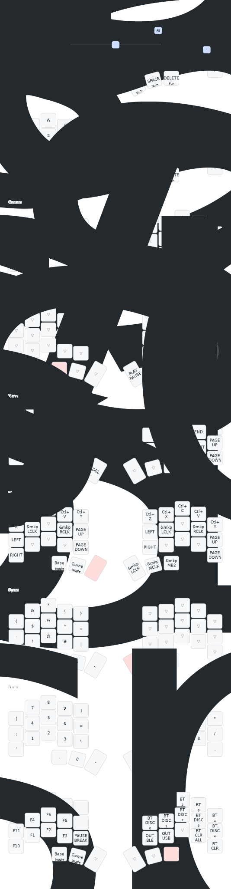

Span Keyboard
=============== 

This project is still being developed as I am polishing the keymap for something I really like. Comments and code might be unstructured or incorrect as changes are implemented.

Controlling my [Span](https://holykeebs.com/products/span), a split wireless-only
mechanical keyboard.

 * QWERTY base layout
 * Modified Miryoku layout
 * moved GUI key to lower row due to many false activations
 * Added a row of combos and hold/tap delays to make better use of the 36 key layout

I will be working out a case for this keyboard shortly. My idea is to keep it as low profile as possible. Likely only a backplate that embeds with the hot sockest. We'll see...

## Keyboard


## Keymap




## Building

Either generate the firmware via the GitHub action, or build locally by setting
up the ZMK toolchain as described [here](https://zmk.dev/docs/development/setup).
Given a directory structure like:

```
...
|-- config-temper/
|-- zephyr-sdk-0.16.5-1/
`-- zmk/
    |-- app
    `-- ...
```

Then from the `zmk/app` directory run the following command to build the
firmware for the left hand board:

```sh
west build -b nice_nano_v2 -p -c -- -DSHIELD="temper_left nice_view_adapter nice_view_temper" -DZMK_CONFIG=../../config-temper-zmk/config -DZMK_EXTRA_MODULES=../../config-temper-zmk -DZephyr-sdk_DIR=../../zephyr-sdk-0.16.5-1/cmake
```

This will produce the file `zmk/app/build/zephyr/zmk.utf`. Put the board into
bootloader mode by pressing the reset button twice, and copy this file to the
board, which will show up as a USB drive when connected to your computer. Repeat
for the right side board.

## Keymap image

The keymap image is created using [keymap-drawer](https://github.com/caksoylar/keymap-drawer).
It can be regenerated with the commands:

```sh
keymap -c img/keymap_drawer.config.yaml parse -c 10 -z config/temper.keymap > img/temper.yaml
keymap -c img/keymap_drawer.config.yaml draw -k chocofi img/temper.yaml > img/temper.svg
```


## Miscellaneous

In MacOS, when a key is held down while entering text, a popup is shown which
lets you choose between various accented forms of the character. The following
command will disable this behaviour.

```sh
defaults write -g ApplePressAndHoldEnabled -bool false
```

## Resources

 * https://github.com/urob/zmk-config
 * https://github.com/caksoylar/keymap-drawer

